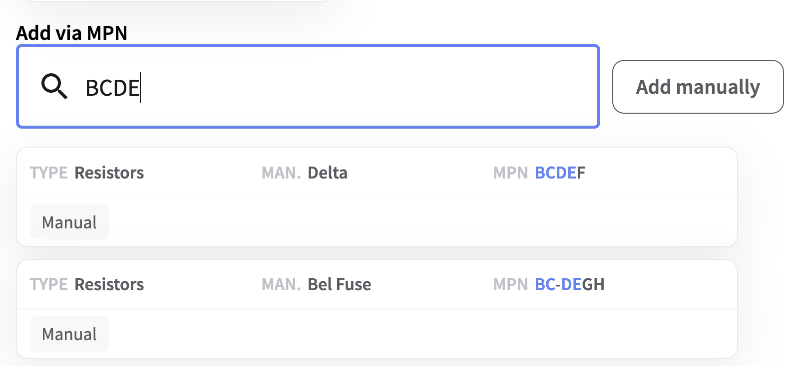

# Challenge 1: MPN Highlighting

## Description
As part of our mission to accelerate progress in the electronics industry, we help Electronics Manufacturing Services (EMS) to find and procure parts they need to build electronic products. These parts are usually given a unique identifier called Manufacturer Part Number, or *MPN* for short.

However, MPNs often look quite confusing, for example  "FH12-5S-1SH(55)" and "ERJ3EKF1000V". To make it easier to understand search results we _highlight_ the search query in returned MPNs so that the user can better understand how they were matched. See example below:

 

Notice how the search query, "BCDE" is highlighted in blue in MPN of results. MPNs often have special characters, like "-" that are ignored during search. So in the second example "BC-DE" is still highlighted. The "-" symbol isn't highlighted.

Also you can safely assume, that all returned MPNs will always contain all characters from the search query string.

Don't worry, we have already implemented highlighting function in [highlighting.rs](highlighting.rs). It's super clean and there are no errors whatsoever. Rust compiler would catch them all anyway. Right? ...

## Summary

Task: _Find and fix errors with our part highlighting._

* Highlighting must be case-insensitive
* Special characters ("-", "/", ".", ",") in the MPN are ignored iff they are not part of the search query

## Examples
 *Highlighting is case insensitive*
 Search query="abc", MPN="ABCDE" -> **ABC**DE 

 *Special characters in the MPN are ignored iff they are not part of the search query*
 Search query="ABC-DEF", MPN="ABC-DE-FG" -> **ABC-DE**-**F**G

